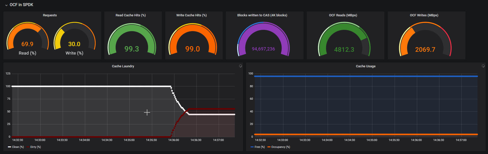
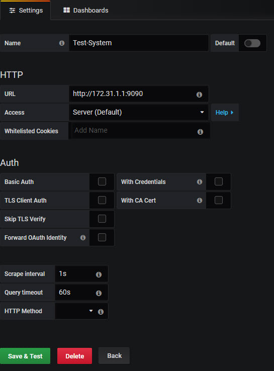
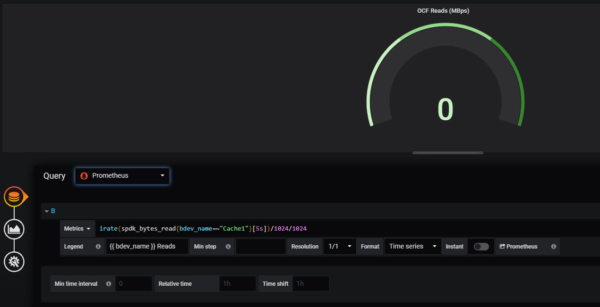
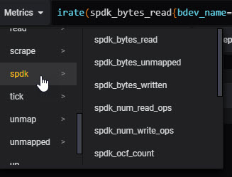

# SPDK-OCF-Parser
This tool parses SPDK Bdevs and OCF data using Prometheus allowing visualization of SPDK and OCF metrics via Grafana.

SPDK is a set of tools and libraries for accelerating storage devices in user-space. More information on SPDK is available here: https://spdk.io/

OCF for SPDK is a caching module for SPDK. More information is available here: https://open-cas.github.io/getting_started_spdk.html

## Example
The following image is from a Grafana dashboard showing the SPDK Parser tool data being graphed via Prometheus


## Usage
spdk_parser [-port=PORT_NUMBER] | [-cache=OCF_BDEV_NAME] |  
            [-log] | [-logfile=FULL_PATH_TO_LOG]  |  
            [-sleep=SECS_TO_SLEEP_BETWEEN_ITERATIONS] |  
            [-rpc=PATH_TO_SPDK_RPC_CMD]  


| Option   |        Argument       |  Description |
|----------|:---------------------:|--------------|
| -port    | PORT_NUMBER           | The TCP port number spdk_parser will bind to in order to publish metrics  |
| -cache   |    OCF_BDEV_NAME      |   The name of the OCF block device to get statistics from |
| -log     |                       | Enable logging     |
| -logfile | FULL_PATH_TO_LOG      |    The path to the log file where output will be sent to when log is enabled  |
| -sleep   | SECS_TO_SLEEP         |    The number of seconds to sleep between iterations of metric gathering  |
| -rpc     | PATH_TO_SPDK_RPC_CMD  |    The full path of the SPDK rpc.py script which will be called to get SPDK statistics |

## Instructions
This tool is written in Go and has been tested with Red Hat Linux 7.5  

To use follow these general instructions:  
1. First install Prometheus  
>```wget https://github.com/prometheus/prometheus/releases/download/v2.10.0/prometheus-2.10.0.linux-amd64.tar.gz```  

>```tar xvzf prometheus-2.10.0.linux-amd64.tar.gz```  
>```cd prometheus-2.10.0.linux-amd64```  

2. Determine what port to use for the SPDK Parser (default is 2113).  Edit the *prometheus.yml* file and add this port as a target ('localhost:2113' for example)
>```vi prometheus.yml```  
  
>> static_configs:
>>            - targets: ['localhost:9090', 'localhost:2113']

3. Start Prometheus  
>``` ./prometheus & ```  

4. If you do not have the Go environment get it with:  
> ```https://golang.org/dl/```  
> ```tar -C /usr/local -xzf go$VERSION.$OS-$ARCH.tar.gz```  
> ```export PATH=$PATH:/usr/local/go/bin```  

5. Install the Prometheus API for Go  
>``` go get github.com/prometheus/client_golang/prometheus```  
>```go get github.com/prometheus/client_golang/prometheus/promauto```  
>```go get github.com/prometheus/client_golang/prometheus/promhttp```  

6. Clone SPDK Parser
> ```mkdir -p /root/go/src```  
> ```cd /root/go/src```  
> ```git clone https://github.com/felipe-barajas/SPDK-OCF-Parser ```

7. Compile SPDK Parser  
> ``` cd SPDK-OCF-Parser ```  
> ``` go build spdk_parser.go ```  
  
8. Run SPDK Parser using the port defined above (2113), getting OCF stats for cache named Cache1, the full path to the SPDK RPC script set to /root/spdk/scripts/rpc.py, logging data to /tmp/spdk_parser.out and sleeping 1 sec between metric recordings
> ``` ./spdk_parser -port=2113 -cache=Cache1 -rpc=/root/spdk/scripts/rpc.py -log -logfile="/tmp/spdk_parser.out" -sleep=1 ```  

9. On the Grafana server setup the newly created Prometheus source. The default port for the Prometheus server is 9090. For example:  


10. On the Grafana server create a dashboard and add a panel. The panel needs to point to the Prometheus data source created in the step above.  The metric query to use is one defined by SPDK Parser. See the next section for all the options.  For example, to see the instantaneous rate of the Reads from the OCF device called "Cache1" grouped by 5s, use a metric query as shown in the picture below  


Alternatively, under the Metrics drop down menu, select the "spdk" section as shown below.

  
All the available metrics exposed by SPDK Parser will appear here. A sample dashboard is also provided in the *sample_dashboard.json* file. This file can be manaully edited and imported into Grafana as well.

### SPDK OCF Parser Queries Supported
The following metrics apply to SPDK Bdevs and can be filtered using bdev_name
For example: rate(spdk_bytes_read{bdev_name="Cache1"}[5s])

- Metric: spdk_bytes_read  
Description: Number of bytes read

- Metric: spdk_num_read_ops  
Description: Number of read operations

- Metric: spdk_bytes_written  
Description: Number of bytes written

- Metric: spdk_num_write_ops  
Description: Number of write operations

- Metric: spdk_bytes_unmapped  
Description: Number of bytes unmapped

- Metric: spdk_unmapped_ops  
Description: Number of unmapped ops

- Metric: spdk_read_latency_ticks  
Description: Number of read latency ticks

- Metric: spdk_write_latency_ticks  
Description: Number of write latency ticks

- Metric: spdk_unmap_latency_ticks  
Description: Number of unmap latency ticks

- Metric: spdk_tick_rate  
Description: The tick rate

For the above metrics the only supported filter is "bdev_name"

---
The following metrics apply to OCF Bdevs and can be filtered using category and subcategory  
For example: spdk_ocf_percentage{category="requests", subcategory="rd_hits"}  

- Metric: spdk_ocf_count  
Description: OCF count value

- Metric: spdk_ocf_percentage  
Description: OCF percentage value 

For the two OCF metrics above, the supported categories are: 
- usage
- requests
- blocks 
- errors

The subcagetories for usage are: 
- occupancy  
- free   
- clean   
- dirty  

The subcategories for requests are: 
- rd_hits 
- rd_partial_misses
- rd_full_misses
- rd_total
- wr_hits
- wr_partial_misses
- wr_full_misses
- wr_total
- rd_pt
- wr_pt
- serviced 
- total.  

The subcategories for blocks and errors are: 
- core_volume_rd 
- core_volume_wr 
- core_volume_total 
- cache_volume_rd 
- cache_volume_wr 
- cache_volume_total 
- volume_rd 
- volume_wr 
- volume_total  


